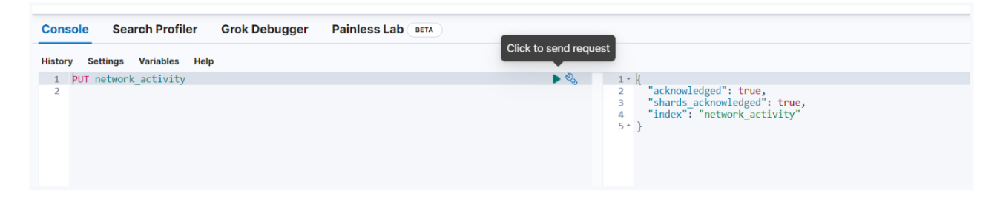

# BASIC SIEM SYSTEM
Bu proje, basit bir Güvenlik Bilgi ve Olay Yönetimi (SIEM) sistemi oluşturmak için Python ve Elasticsearch kullanır. SIEM sistemi, ağ trafiğini izlemek, güvenlik olaylarını tespit etmek ve kaydetmek için kullanılır.

##Kurulum
1) Python'un yüklü olduğundan emin olun.
2) Kendinize elastic cloud hesabı açın ( trial olarak 14 günlük ücretsiz kullanabilirsiniz üye olmak için => https://cloud.elastic.co/registration?elektra=guide-welcome-cta ) ayrıca elastic searchi localinizde de kurabilirsiniz.
3) Uygulamaya kaydolduktan sonra kendinize bir deployment oluşturmanız gerekiyor. (Burada size kullanıcı adı ve şifre verecektir auth.py dosyasını buradaki verilerle dolduruyoruz.)
4) Projede kullanmamız için kendimiz bir adet index oluşturmamız gerekir bunu yapmanın bir çok yolu var ancak ben dev toolstan minik bir sorgu oluşturarak yapmayı tercih ettim. devtools >> console ardından da "PUT index_adı" yazmanız yeterli
   yan tarafta size true olarak dönecektir.
   

   not: projede şimdilik log_event_generator_basic ve log_event_generator classları mevcuttur. Projeyi geliştirdikçe buradan da paylaşıyor olacağım :)
   
